<div align="center">



<a href="https://readme-typing-svg.demolab.com">
  
</a>

</div>


```sh
┌─[ archnexus707@nexus ]─[ ~/ops ]
└──╼ whoami --verbose

  focus    red / purple team · adversary emulation · web & AD exploitation
  stack    python · bash · powershell · c# · go
  arsenal  burp · metasploit · bloodhound · impacket · nuclei · sigma · yara
  domain   break it → write the report that keeps it broken
```

<div align="center">

### → **[archnexus707.github.io](https://archnexus707.github.io/)** — full portfolio · ops log · certs & repos

<a href="https://www.linkedin.com/in/dickson-godwin-963114249/"></a>
<a href="https://app.hackthebox.com/users/2109500"></a>
<a href="https://tryhackme.com/p/hackerreal935"></a>
<a href="mailto:dicksonmassawe707@gmail.com"></a>

</div>


<div align="center">

## `// LANGUAGES`


## `// RED TEAM // PENTEST ARSENAL`


<br/>


</div>


<div align="center">


</div>


<div align="center">


<sub><code>領域展開</code> · cursed energy compiles the contribution graph</sub>

</div>


<div align="center">

</div>
